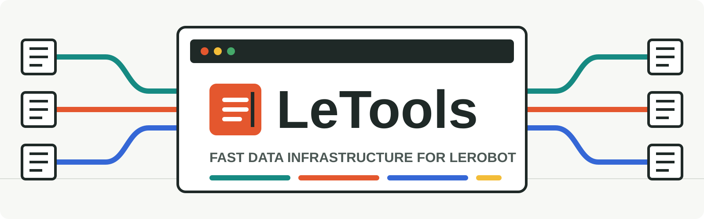
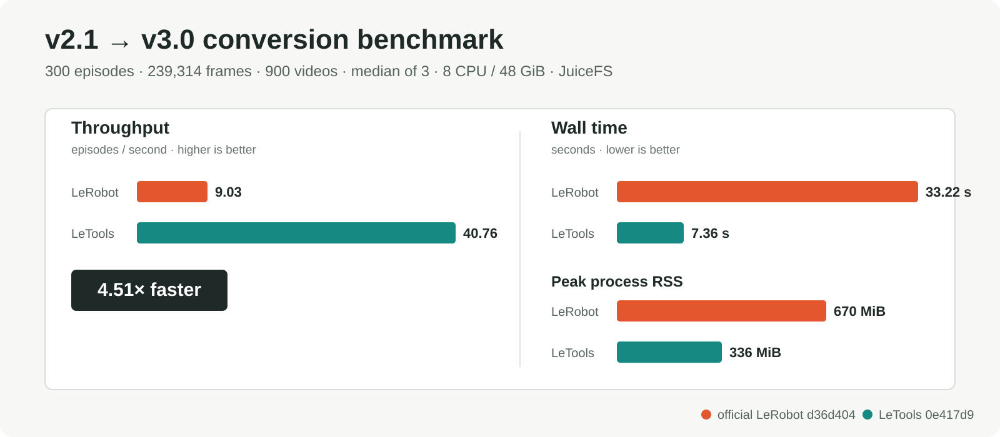
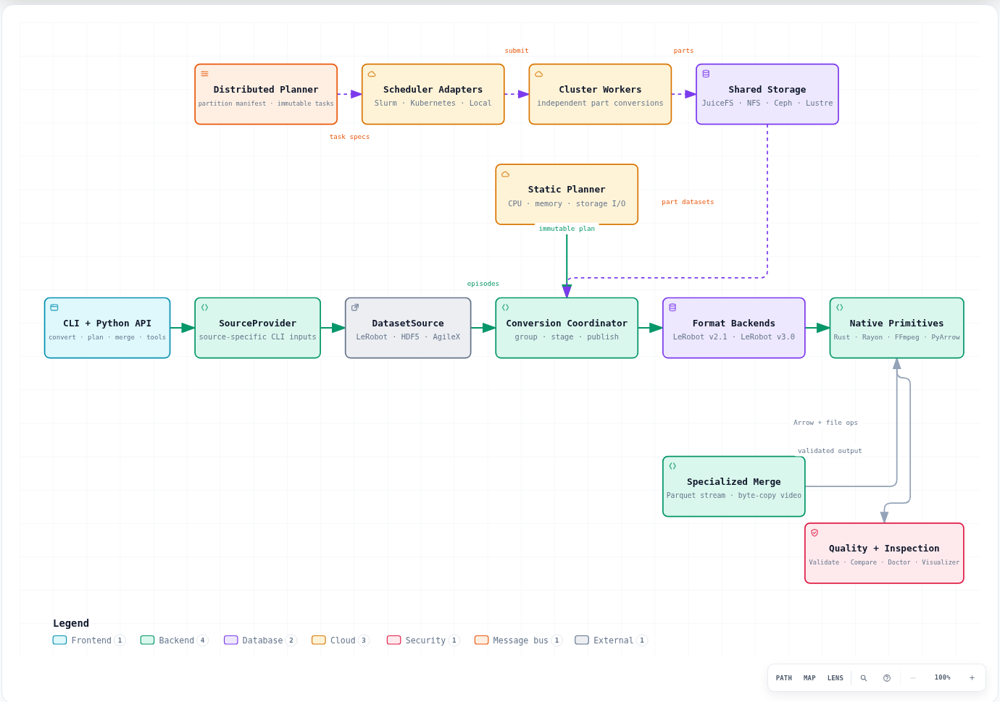
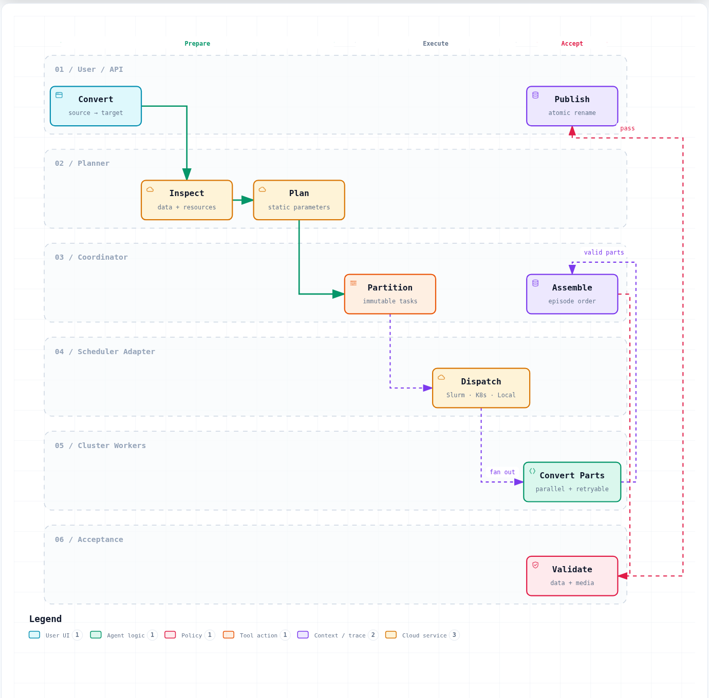

<p align="center">
  
</p>

<h1 align="center">LeTools: High-Performance Data Operations for LeRobot</h1>

<p align="center">
  Convert heterogeneous robot data, merge LeRobot datasets, plan machine resources,
  and scale the same workflow from one process to Slurm or Kubernetes.
</p>

<p align="center">
  <a href="https://github.com/XieWeikai/letools/actions/workflows/ci.yml"></a>
  <a href="https://xieweikai.github.io/letools/"></a>
  
  
  <a href="LICENSE"></a>
</p>

LeTools is a Python and Rust toolkit for building and operating
[LeRobot](https://github.com/huggingface/lerobot) datasets. It keeps format
policy and plugin ergonomics in Python, then moves packet-, file-, and
table-heavy work into coarse native operations that release the GIL.

- **Convert more sources.** LeRobot v2.1, LeRobot v3.0, mapped HDF5, and
  timestamp-aligned AgileX recordings can target v2.1 or v3.0.
- **Round-trip LeRobot.** Convert v2.1 to v3.0 and v3.0 back to v2.1 with
  semantic metadata, Arrow values, statistics, and packet-payload checks.
- **Merge at the physical-layout level.** A specialized same-version engine
  streams Parquet rewrites and reuses complete video files without transcoding.
- **Plan for the actual machine.** Static planning profiles the dataset, CPU,
  memory, and both source and destination storage before choosing workers and
  v3 shard targets.
- **Scale without binding to one scheduler.** Immutable distributed plans run
  through Local, Slurm, or Kubernetes adapters with retry-safe shared state and
  transactional publication.
- **Inspect the result.** The complete pinned
  [LeRobot Doctor](https://github.com/jashshah999/lerobot-doctor) and
  [LeRobot Dataset Visualizer](https://github.com/huggingface/lerobot-dataset-visualizer)
  are integrated behind the same `letools` command.

## Quick Start

Python 3.12 or newer and [uv](https://docs.astral.sh/uv/) are required.

```bash
git clone --recurse-submodules https://github.com/XieWeikai/letools.git
cd letools
uv tool install .
letools doctor
```

`uv tool install .` publishes a user-level `letools` command; no virtual
environment activation or per-shell FFmpeg setup is required. Linux x86-64
uses the packaged Rust/FFmpeg hot path. Other supported platforms select the
portable PyAV path automatically. See [Installation](docs/INSTALLATION.md) for
developer builds, wheel behavior, and existing non-recursive clones.

## Use LeTools

Convert between LeRobot layouts and let the planner tune the run:

```bash
letools convert /data/dataset-v21 /data/dataset-v30 --to v3.0 --auto
letools convert /data/dataset-v30 /data/dataset-v21 --to v2.1 --auto
```

Create an interactive HDF5 mapping preset, then reuse it in local or batch
conversion:

```bash
letools tools hdf5-preset create /data/hdf5 --name soft-fold
letools convert /data/hdf5 /data/soft-fold-v30 \
  --source-format hdf5 --preset soft-fold --to v3.0 --auto
```

Merge physical datasets without routing them through the generic source and
backend path:

```bash
letools merge /data/part-a-v30 /data/part-b-v30 \
  --output /data/combined-v30 --auto
```

Validate, diagnose, and inspect:

```bash
letools validate /data/combined-v30 --deep
letools doctor check /data/combined-v30 --max-episodes 20
letools visualizer setup
letools visualizer serve /data/combined-v30 --open
```

The [complete command reference](docs/USAGE.md) documents every conversion,
merge, planner, distributed, Doctor, Visualizer, and preset option. The
[Python API](docs/USAGE.md#11-python-api) exposes the same typed operations for
custom pipelines.

## Performance

On the shared operation supported by both projects, LeTools converted a
300-episode LeRobot v2.1 dataset to v3.0 **4.51x faster** than the unmodified
official converter, while using roughly half the peak process RSS.

<p align="center">
  
</p>

| Measurement | Official LeRobot | LeTools |
| --- | ---: | ---: |
| Median wall time | 33.22 s | **7.36 s** |
| Episode throughput | 9.03 episodes/s | **40.76 episodes/s** |
| Frame throughput | 7,204 frames/s | **32,516 frames/s** |
| Median peak process RSS | 670 MiB | **336 MiB** |

The benchmark used 300 episodes, 239,314 frames, 900 videos, and 3.51 GiB of
physical input on one Slurm node with 8 allocated CPUs, 48 GiB memory, an Intel
Xeon Platinum 8468V, and JuiceFS for both source and destination. A same-job
1 GiB sequential write probe measured 1,056 MiB/s; a warm cached read scan
measured a 25.05 GiB/s ceiling and is not presented as backend bandwidth.

Results are three-run interleaved medians from LeTools `0e417d9` and official
LeRobot `d36d404`, using identical 100/256 MiB shard targets. Both outputs
deep-validated, and semantic comparison matched all episodes, frames, and 900
encoded video packet payloads. Read the [full methodology, samples, resource
accounting, and limitations](docs/PERFORMANCE.md).

## Architecture

Python owns user-facing policy: provider-specific CLI options, source plugins,
the common episode model, planners, and orchestration. Backends own only their
target layout. Rust/Rayon, FFmpeg, and PyArrow are reusable execution
primitives below those boundaries. Merge, quality tools, and distributed
scheduling remain separate paths so their specialized behavior does not add
branches to conversion hot loops.

<p align="center">
  
</p>

The architecture image was generated from the checked-in
[Archify source](media/readme/diagrams/letools-architecture.archify.json).
The [architecture reference](docs/ARCHITECTURE.md) defines every public module,
ownership boundary, source-provider contract, backend contract, and native
interface.

## Distributed Workflow

Distributed conversion serializes a portable source description and immutable
episode task manifest. Scheduler adapters only launch the common worker
protocol; they do not know dataset semantics. Each retry-safe worker produces a
valid part on shared POSIX storage, and the last successful worker takes a lock,
merges, validates, and atomically publishes.

<p align="center">
  
</p>

```bash
letools dist plan /shared/v21 /shared/v30 --to v3.0 \
  --job-dir /shared/letools-jobs/v30 --tasks 64 \
  --workers 8 --video-workers 3

letools dist submit /shared/letools-jobs/v30 \
  --scheduler slurm --max-parallel 8 \
  --cpus-per-task 16 --memory 64G

letools dist status /shared/letools-jobs/v30
```

The same plan can be submitted as a Kubernetes Indexed Job with
`--scheduler kubernetes`. The MVP requires source, job, and destination paths
to be visible at identical absolute paths on all workers. See the
[distributed architecture and operations guide](docs/DISTRIBUTED.md) and its
[Archify workflow source](media/readme/diagrams/distributed-conversion.archify.json).

## Documentation

The full documentation is published at **[xieweikai.github.io/letools](https://xieweikai.github.io/letools/)**.

| Area | Guide |
| --- | --- |
| Install and runtime providers | [Installation](docs/INSTALLATION.md) |
| Every CLI command and Python API | [Complete usage](docs/USAGE.md) |
| Source, backend, planner, and native boundaries | [Architecture](docs/ARCHITECTURE.md) |
| CPU, memory, source/destination I/O planning | [Static planner](docs/PLANNER.md) |
| Same-version high-speed merge | [Merge engine](docs/MERGE.md) |
| Local, Slurm, and Kubernetes execution | [Distributed conversion](docs/DISTRIBUTED.md) |
| HDF5 mappings and preset TUI | [HDF5 presets](docs/HDF5_PRESETS.md) |
| Quality checks and repair | [Dataset Doctor](docs/DOCTOR.md) |
| Local and Hub visualization | [Dataset Visualizer](docs/VISUALIZER.md) |
| Reproducible performance evidence | [Performance](docs/PERFORMANCE.md) |

## Citation

If LeTools is useful in your research or data pipeline, cite the repository:

```bibtex
@software{letools2026,
  author  = {Xie, Weikai},
  title   = {LeTools: High-Performance Data Operations for LeRobot},
  year    = {2026},
  url     = {https://github.com/XieWeikai/letools},
  license = {MIT}
}
```

## Contribute

Bug reports, source-format proposals, performance evidence, and focused pull
requests are welcome. Before opening a PR:

```bash
git clone --recurse-submodules https://github.com/XieWeikai/letools.git
cd letools
uv sync --locked --group test --group native-dev
uv run pytest -q
cargo clippy --manifest-path native/Cargo.toml --locked -- -D warnings
```

Conversion optimization changes should follow the checked-in
[self-improvement protocol](self-improve/PROTOCOL.md): preserve semantic
correctness, publish full resource and profile evidence, and weigh complexity
against measured throughput. Use [GitHub Issues](https://github.com/XieWeikai/letools/issues)
for bugs and design discussions.

## Acknowledgements

LeTools builds around the dataset formats defined by
[Hugging Face LeRobot](https://github.com/huggingface/lerobot) and pins the
upstream [LeRobot Doctor](https://github.com/jashshah999/lerobot-doctor) and
[Dataset Visualizer](https://github.com/huggingface/lerobot-dataset-visualizer)
as Git submodules. Architecture visuals are authored with
[Archify](https://github.com/tt-a1i/archify). Each dependency retains its own
license; LeTools itself is released under the [MIT License](LICENSE).
